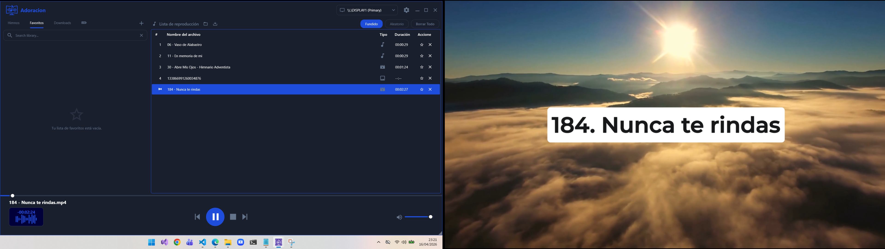
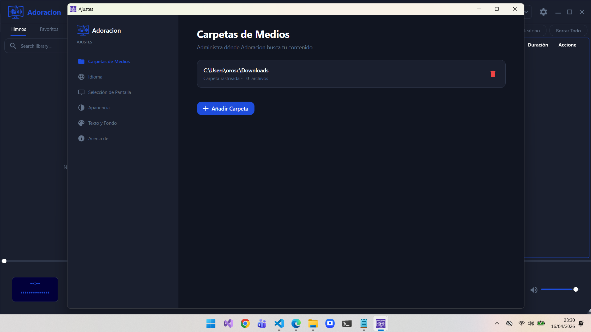

[English](README.md) | [Español]

# Adoracion Reproductor de Medios

**Adoracion** es un reproductor multimedia de código abierto diseñado específicamente para presentaciones multipantalla en entornos de adoración. Construido con C# y WPF, aprovecha el potente motor LibVLCSharp para proporcionar una reproducción de alto rendimiento de video, audio e imágenes de alta resolución.

## Características Clave
- **Soporte Multipantalla:** Salida de medios dedicada para pantallas secundarias/proyectores mientras se mantiene una interfaz de control para el operador.
- **Transiciones Fluidas:** Fundido cruzado (crossfading) integrado para audio y transiciones suaves para medios visuales.
- **Gestión de Listas de Reproducción:** Guarda, abre y reordena fácilmente las listas de reproducción con soporte para arrastrar y soltar.
- **Integración de Biblioteca:** Acceso rápido a carpetas locales de himnos, pistas favoritas y unidades extraíbles (USB).
- **Temas Personalizables:** Soporte para modos Claro y Oscuro con temas de acento personalizados.
- **Renderizado de Imagen Nativo:** Visualización de imágenes de alta eficiencia para minimizar el uso de memoria durante las presentaciones.

## Atajos de Teclado (Hotkeys)

| Tecla | Acción |
|-----|--------|
| `Espacio` | Reproducir / Pausa |
| `Esc` | Detener reproducción / Limpiar foco de búsqueda |
| `Ctrl + F` | Enfocar el cuadro de búsqueda de la biblioteca |
| `Ctrl + S` | Guardar la lista de reproducción actual |
| `Ctrl + O` | Abrir una lista de reproducción guardada |
| `Flecha Arriba` | Aumentar Volumen |
| `Flecha Abajo` | Disminuir Volumen |
| `Flecha Izquierda` | Retroceder 5 segundos |
| `Flecha Derecha` | Adelantar 5 segundos |

## Configuración

La aplicación guarda las preferencias en un archivo `UserSettings.json` ubicado en el directorio raíz.

- **Language:** Almacena el código del idioma actual de la interfaz (ej. `en`, `es`, `it`).
- **EnableLogging:** Una bandera booleana para habilitar o deshabilitar el registro de depuración (logs).
- **Crossfade:** Alterna la función de transición de audio suave entre pistas.
- **ThemeName:** El nombre del tema de acento personalizado seleccionado (por defecto `default`).
- **ThemeMode:** Define el estilo visual base, ya sea `Light` (Claro) o `Dark` (Oscuro).

## Lanzamientos (Releases)

Puedes descargar los binarios estables más recientes y ver el historial de cambios aquí:

- **Última Versión Estable:** Descargar x86 *Versión 0.9.0.1-beta*
                     Descargar x64 *Versión 0.9.0.1-beta*
- **Todos los Lanzamientos:** Página de *Releases en GitHub*

## Instalación
1. Asegúrate de tener instalado el entorno de ejecución (Runtime) de .NET.
2. Descarga el último lanzamiento desde los enlaces de arriba.
3. Extrae los archivos y ejecuta `Adoracion.exe`.
4. Coloca tus archivos multimedia en la carpeta `Hymns` o añade tus propios directorios en el menú de **Ajustes**.

---

## Dependencias de Terceros y Licencias

Este proyecto utiliza los siguientes paquetes NuGet. Cada uno es compatible con la licencia GNU GPL v3:

| Paquete                        | Versión   | Licencia        |
|---------------------------------|-----------|-----------------|
| LibVLCSharp                     | 3.9.6     | LGPL v2.1+      |
| LibVLCSharp.WPF                 | 3.9.6     | LGPL v2.1+      |
| VideoLAN.LibVLC.Windows.GPL     | 3.0.23    | GPL v2+         |
| Microsoft.Data.Sqlite           | 10.0.5    | MIT             |
| SQLite                          | 3.13.0    | Public Domain   |
